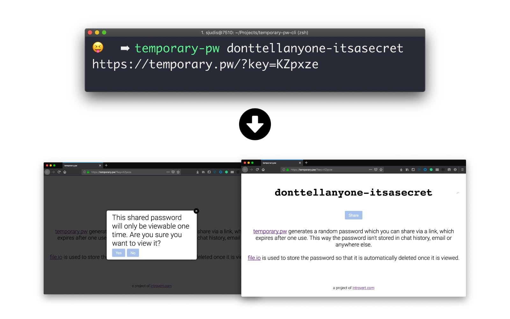

# temporary-pw-cli

Tiny CLI wrapper around [temporary.pw](https://temporary.pw) to create one-time password links easily.



## Install

```bash
$ npm install -g temporary-pw
```

## Usage

```
Usage
  $ temporary-pw <password>

Options
  --copy-to-cb, -c  Copy URL to clipboard

Examples
  $ temporary-pw unicorns
  -> https://temporary.pw/?key=scAjSF

  $ temporary-pw unicorns -c
  (URL is in your clipboard)
```

## License

MIT © [Stefan Judis](https://www.stefanjudis.com)
